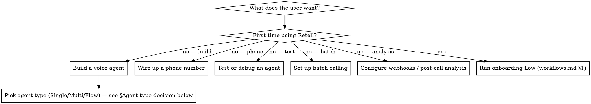

# Retell AI

Operate [Retell AI](https://docs.retellai.com) voice agents through the browser at `dashboard.retellai.com` via Codex-in-chrome. Covers account setup, agent creation, phone-number wiring, testing, deployment, webhooks, and post-call analysis. Includes ready-to-paste templates for common agent types.

## When to use

- User wants to create, edit, test, or debug a Retell voice agent
- Setting up inbound or outbound phone numbers
- Configuring webhooks, post-call analysis, or batch calling
- Importing a Twilio number via SIP
- Troubleshooting call quality, latency, or unexpected behaviour
- Productising voice agents for a client (use one Retell workspace per client)

## Before you start — mandatory checks

1. **Codex-in-chrome must be available.** If not, STOP and tell the user. All navigation depends on browser automation.
2. **Identify which Retell workspace the user is operating on** before any destructive action. Retell isolates everything by workspace; the wrong workspace = wrong client's agents. Confirm the workspace name shown in the top-left of the dashboard.
3. **Never auto-click "Delete", "Archive", or "Unbind" without explicit confirmation from the user.** Describe what you're about to do, wait for "yes".
4. **Screenshot before and after any change.** Catches UI drift and creates a record.

## Core workflow selector



## Agent type decision

Retell has three response engines. Pick the right one first — switching later is painful.

| Engine | Use when | Ceiling |
|---|---|---|
| **Single Prompt** | One goal, simple flow, ≤5 tools, prompt ≤1000 words. Fastest to build. | Reliability drops past 1000 words or 5 tools. |
| **Multi-Prompt** | State-based flow (greeting → qualify → book → close). Better debuggability when you have 3–4+ distinct phases. | Still linear-ish; struggles with heavy branching. |
| **Conversation Flow** | Visual graph for complex branching, IVR navigation, Cal.com bookings with availability checks, or any flow where the path depends on live data. | Flex Mode inflates tokens (watch the 3,500-token billing threshold). |

**Default guidance for common templates:**
- Lead qualifier (inbound or outbound), qualification only → **Single Prompt**
- **Qualifier that also books a single next-available slot** → **Single Prompt** with inline Cal.com booking (like `templates/inbound-lead-qualifier.md`). Most inbound ad-lead flows are this.
- **Qualifier that offers multiple slots or re-queries on rejection** → **Conversation Flow** (`templates/appointment-booker.md`).
- Receptionist with 3+ intents (sales/support/billing) → **Multi-Prompt**
- Complex appointment booking with availability lookup + re-query + branching → **Conversation Flow**

**Rule of thumb:** Start with Single Prompt unless the booking flow needs to offer 3+ alternatives or loop on rejection. Upgrading later is cheap; building Conversation Flow when you don't need it is expensive (tokens + complexity).

## Files in this skill

Read these on demand — don't preload everything.

- `reference.md` — Dashboard map, all agent settings with recommended defaults, pricing math, gotchas list. Read when configuring settings or debugging.
- `prompt-patterns.md` — Retell's Identity/Style/Guidelines/Task/Objection prompt structure + patterns for common behaviours. Read when writing or reviewing an agent prompt.
- `workflows.md` — Step-by-step browser-driven workflows: onboarding (§1), building agents (§2), buying numbers (§3), importing Twilio (§4), webhooks + post-call analysis (§5), batch calling (§6), debugging (§7), MCP setup (§8), client workspace creation (§9), **Cal.com integration (§10)**. Read the specific section you need, not the whole file.
- `templates/` — Five business-agnostic starter templates (inbound-lead-qualifier, outbound-offer-followup, inbound-receptionist, appointment-booker, voicemail-handler). Read when building a new agent of that type.

## Workspace-per-client model

The user operates one Retell workspace per client (including their own businesses treated as clients). Consequences:

- Each workspace has its own API key, phone numbers, agents, billing, concurrency limit.
- The Retell MCP (`https://retell.stlmcp.com`) is per-key — configure multiple MCP entries named `retell-<client>` if the user wants programmatic access to more than one workspace.
- When switching tasks between workspaces, **verify the workspace name in the dashboard top-left before making changes**.

## Browser-driven operation rules

When executing any workflow in the dashboard:

1. **Announce the step** — "Opening dashboard.retellai.com and navigating to Agents…"
2. **Screenshot after each navigation** — confirm you're where you expect.
3. **For form fields, read back the value before submitting** — "I'm about to set interruption_sensitivity to 0.6. Confirm?"
4. **After any state change, screenshot and verify the success indicator** (toast, "Saved" badge, etc.). Don't trust the click — trust the confirmation.
5. **Console errors matter.** Run `read_console_messages` after any non-trivial action. JS errors on the dashboard often indicate the save didn't persist.
6. **If something unexpected happens, stop and report.** Don't guess your way through. The user can't see the browser — your description is their only window.

## MCP (optional, recommended after onboarding)

Retell ships an official hosted MCP at `https://retell.stlmcp.com`. Once the user has an API key, configure via:

```bash
Codex mcp add --transport http retell-<client-name> https://retell.stlmcp.com \
  --header "Authorization: Bearer <RETELL_API_KEY>"
```

One MCP entry per workspace. Use MCP for bulk/programmatic work (creating agents, listing calls, updating many agents). Keep using the browser for: LLM Playground, Web Test Call, Conversation Flow graph editing, listening to recordings, billing, post-call analysis dashboards.

Full MCP setup walkthrough: `workflows.md` §8.

## Critical gotchas (the top 7)

Full list in `reference.md`. These bite everyone:

1. **Outbound calls require KYC.** The user can't dial out until KYC passes. Build this into onboarding — submit KYC immediately after signup so it's approved by the time they want to test outbound. (Inbound-only agents don't need KYC; skip the wait if outbound isn't in scope yet.)
2. **Agents don't hang up by themselves.** Add the End Call tool AND write explicit prompt instructions on when to call it. Without both, calls run to max duration (1h default).
3. **Tool names are case-sensitive in prompts.** Use `end_call`, `transfer_call`, `check_availability`, `book_appointment` — lowercase snake_case. The LLM won't invoke a tool if the casing doesn't match the tool's underlying name, even if the UI label is "End Call".
4. **Prompts over 3,500 tokens cost proportionally more per minute.** Keep prompts lean. Agent Handbook presets and Flex Mode inflate tokens — watch the count. Don't duplicate the same instruction in a preset AND the prompt.
5. **Twilio SIP import: the username is NOT the friendly name.** Friendly name is the display label. Use the SIP credential's actual username.
6. **Build the agent BEFORE buying/binding a phone number.** The "bind to agent" dropdown is empty if no agent exists. Order: KYC → first agent → buy/import number → bind.
7. **Recording URLs expire in 10 minutes when PII-restricted storage is on.** Download immediately if you need persistence, or switch storage mode for that agent.

## Pricing mental model

Default config (GPT 4.1 + platform voice + Twilio US telephony): **~$0.13/min** = ~$0.39 for a 3-minute call. Swap to Codex or GPT 5.4: ~$0.165/min. Premium ElevenLabs voice: +$0.025/min. Add Knowledge Base retrieval: +$0.005/min or $8/month flat.

Full calculator with all variants: `reference.md` §Pricing.

## Red flags — stop and verify

- About to click anything labelled "Delete", "Unbind", "Archive", "Suspend"
- About to apply a change to more than one agent at once
- User hasn't specified which workspace they're in
- Dashboard shows a workspace name you don't recognise
- Console shows errors after a save
- Browser returns a 5xx or auth redirect

Any of these → stop, describe, ask for confirmation.
