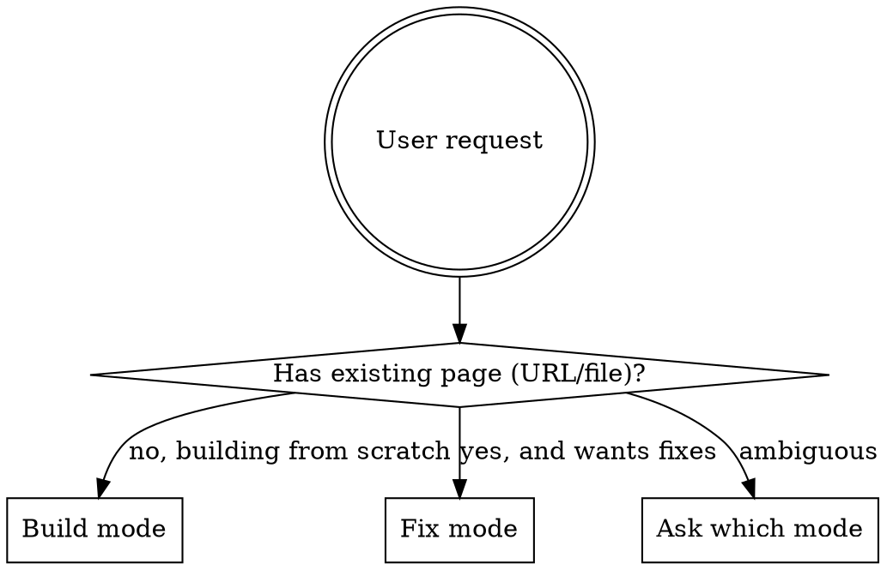

# Hormozi Landing Pages

## Overview

Apply Alex Hormozi's landing page framework to build new pages from scratch or surgically fix existing ones. Source: Hormozi's value equation + above-the-fold focus (80-90% of conversion impact) + headline-led structure.

**Core principle:** Doubling conversions beats doubling traffic. Above the fold is where 60% of visitors stop — so 80-90% of your effort lives there. Every section headline must work standalone, because most people scan.

This skill is the **strategy + copy layer**. After the brief is produced, hand off to a build skill (`frontend-design`, `website-builder`, `coder`) to render it.

## When to Use

Use this skill when the user says:
- "Build a landing page for [offer]"
- "Fix my landing page" / "Audit my landing page"
- "Rebuild this page" with an existing URL
- "Why isn't this page converting?"
- "Make this page convert better"
- Any mention of Hormozi, value equation, above the fold, or CRO in a landing page context

**Don't use for:**
- Homepage redesign of a multi-page site — use `frontend-design` or `design-system`
- General CRO across signup flows, popups, forms — use `signup-flow-cro`, `popup-cro`, `form-cro`
- Audience research-driven optimisation — use `landing-page-optimization` (Digital Twins). Pair the two: research informs inputs, this skill structures output.
- SaaS marketing site copy without conversion focus — use `conversion-copywriting`

## Mode Detection



If the user gives you a URL but says "rebuild from scratch", treat as BUILD mode with the existing page as research input.

## BUILD Mode (new landing page)

**Step 1: Intake interview.** Ask questions one at a time. Do NOT batch. Full question list in [build-mode-interview.md](build-mode-interview.md). Minimum required:
1. Business + offer (what you sell)
2. Target customer (who buys it)
3. Dream outcome (what they really want — not your feature, their result)
4. Proof assets available (reviews, before/afters, case studies, video testimonials, screenshots, stats)
5. Time to first result (days/weeks)
6. Risk reversal available (guarantee, free trial, no-contract, money-back)
7. Effort level for the customer (effortless? Some work? Heavy lift?)

If the user already has a brief that covers these, skip the interview and confirm gaps.

**Step 2: Apply the value equation to plan the page.** See [value-equation-reference.md](value-equation-reference.md) for full mapping. Quick version:

| Equation component | Where it lives on the page |
|--------------------|----------------------------|
| Dream outcome | Headline (above fold) + section headlines throughout |
| Perceived likelihood | Social proof above fold + stacked wall of love + risk reversal under CTAs |
| Time delay | Subheadline + headline qualifiers ("in 30 days", "in 2 weeks") |
| Effort & sacrifice | Subheadline ("without X, Y, Z") + "How it works" section (3-4 steps MAX) |

**Step 3: Generate the brief.** Output a markdown document with these sections in order. Don't skip any. Be specific — no placeholders, no "[insert headline here]".

```
# Landing Page Brief: [Business + Offer]

## Above the Fold (80-90% of CRO effort)
- **Headline:** [Dream outcome using "so that" principle. Specific, not generic.]
- **Subheadline:** [How they get it. Reduces effort. "Without X, Y, Z" pattern works.]
- **Primary CTA:** [Action verb + outcome, not "Get Started" or "Learn More"]
- **Hero image brief:** [Visual proof of the dream outcome. Describe what to show.]
- **Trust strip / above-fold proof:** [Stat, logo row, star rating, or "X customers served"]
- **Under CTA:** [3-5 risk reversal badges: guarantee, warranty, no contract, free trial, etc.]

## Social Proof Section (visual + stacked, never carousel)
- **Section headline:** [Works standalone when scanned]
- **Format:** [Wall of love / before-after grid / video testimonial stack / screenshot collage]
- **Specific assets to feature:** [Map proof assets from intake to slots]

## How It Works (3-4 steps MAX)
- **Section headline:** [Promises effortlessness — "Three simple steps", "Get [outcome] in 7 days"]
- **Step 1:** [Verb + outcome, one line]
- **Step 2:** [Verb + outcome, one line]
- **Step 3:** [Verb + outcome, one line]
- (Step 4 only if essential)

## Offer / Value Stack
- [What's included, framed as outcomes not features]
- [Bonus stack if applicable]
- [Pricing or "book a call" path]

## Risk Reversal Section
- [Full guarantee language, expanded from the under-CTA badges]
- [Reduces the perceived risk of saying yes]

## FAQ (handles objections, not generic questions)
- [Question that reflects a real buyer objection]
- [Answer that reframes the objection]
- (5-8 questions max)

## Final CTA Block
- **Headline:** [Last chance to act, restates dream outcome]
- **CTA button:** [Same action as primary]
- **Risk reversal repeat:** [Same badges as above fold]

## Notes for the builder
- Section headlines that should be tested first: [headline, hero image]
- Mobile-first considerations: [proof must show without carousel, CTAs above keyboard fold]
- Assets the user still needs to create: [list gaps]
```

**Step 4: Offer to hand off.** After delivering the brief, ask:
> "Brief ready. Want me to hand this to `frontend-design` (premium React/Next.js), `website-builder` (full site with quality gates), or `coder` (just the page in your existing stack)?"

## FIX Mode (existing landing page)

**Step 1: Fetch the page.**
- URL → use `mcp__claude-in-chrome__navigate` + `mcp__claude-in-chrome__read_page` or `WebFetch` (load via ToolSearch)
- Local file → use Read
- Take a screenshot if the visual layout matters (above-fold density, proof placement, button hierarchy)

**Step 2: Score against the rubric.** Full rubric in [fix-mode-rubric.md](fix-mode-rubric.md). Six criteria, 0-10 each:

1. **Above-fold clarity** — does the headline answer "who is this for, what do they get, why care?" in <3 seconds?
2. **Value equation coverage** — are dream outcome, likelihood, time, and effort all addressed somewhere on the page?
3. **Headline strength** — if you only read the headlines and skipped body copy, would you understand the offer?
4. **Social proof quality** — visual? Stacked? Specific? Or generic text testimonials hidden in a carousel?
5. **Risk reversal** — is there a guarantee/badge/warranty under every CTA?
6. **How-it-works simplicity** — 3-4 steps, or 5+ that feel like work?

Sum to a score out of 60. Anything under 36 is a rebuild candidate, not a surgical fix.

**Step 3: Output prioritised fix list.** Group by impact, not by criterion:

```
# Landing Page Audit: [URL]

**Score: X/60**

## Critical (above the fold — fix these first, biggest conversion impact)
1. [Specific issue] → [Specific fix with replacement copy]
2. ...

## Major (proof, risk reversal, headline scan-readability)
1. [Specific issue] → [Specific fix with replacement copy]
2. ...

## Polish (below-fold headlines, FAQ, micro-copy)
1. [Specific issue] → [Specific fix with replacement copy]
2. ...

## Optional: Full rebuild recommended if
- Score below 36/60, OR
- Above-fold scores 4 or less, OR
- No proof assets exist on the page at all
```

For each fix, write the actual replacement copy. Don't say "improve the headline" — write the new headline.

**Step 4: Offer to apply.** After delivering the audit:
> "Fix list ready. Want me to apply these to the page directly (if local file), or generate a build brief for a rebuild?"

## The Framework (quick reference)

### Above the fold
- 80-90% of conversion effort lives here
- 60% of visitors never scroll past
- Must contain: headline, subheadline, CTA, hero image, trust signal, risk reversal under CTA
- Test headlines and images first — that's 90% of impact

### The "so that" principle (for headlines)
Generic: "We offer exterior cleaning"
Hormozi: "We offer exterior cleaning **so that** your solar panels produce more energy **so that** you cut your energy bill **so that** you feel confident your solar is working"

Result from this exact rewrite: 64% conversion lift.

Chain "so that" until you hit the actual dream outcome. Then use the last "so that" clause (or the full chain compressed) as the headline.

### Headlines = 80% of advertising dollar (Ogilvy)
- People scan, don't read
- Every section headline must communicate value standalone
- If a visitor only read your headlines (and skipped all body copy), would they get the offer? If not, the headlines are doing too little work.
- Replace: "What makes us unique" → "[Actually what makes you unique]"
- Replace: "How it works" → "[Actually how it works, in one phrase]"
- Replace: "What our customers say" → "[The result the customer got]"

### Social proof rules
- **Visual > text** — "I lost 20lb" (text) < before/after photo < weighing-in video
- **Stack proof** — wall of love > one testimonial. Overwhelm them.
- **Never hide in carousel** — carousels have low engagement; what's hidden doesn't get seen
- **Show on mobile too** — don't collapse the proof to a single card on small screens
- **Place above fold AND throughout** — build trust before they read anything else

### Risk reversal
- Goes under every CTA, not just one
- Format: 3-5 small badges or checkmark list
- Examples: "30-day money-back guarantee", "No contract", "Free trial — no card required", "Lifetime warranty", "Free installation"
- 30% conversion lift documented from badges under add-to-cart alone

### How it works
- 3-4 steps. Not 5. Not 6.
- More than 4 steps signals "this is work"
- Each step: verb + outcome, one line
- Section headline: promise effortlessness ("Three simple steps to [outcome]")

### AB testing cadence (for ongoing CRO)
- One test per week. Just one.
- 90% of tests should be headline or hero image
- Need 40-50k monthly visitors for traditional AB testing (to reach statistical significance)
- Below that threshold: don't AB test, do larger revamps based on framework best practices

## Common Mistakes & Rationalisations

| Rationalisation | Reality |
|-----------------|---------|
| "Above-fold doesn't matter that much, the offer details are below" | 60% of visitors never scroll. If the above fold doesn't sell, nothing else gets read. |
| "We need more traffic first" | Doubling conversions amplifies every dollar spent on traffic. Fix the leak before pouring in more water. |
| "Our headline is fine, focus on the body copy" | David Ogilvy: 80 cents of every advertising dollar is the headline. Most visitors only see headlines. |
| "Text testimonials are enough, video is too much work" | Visual proof converts 50-70% better than text. Even one before/after photo beats a paragraph of praise. |
| "Risk reversal undermines our premium positioning" | 30% lift documented from badges under add-to-cart. Premium brands offer guarantees too — Apple, Stripe, AmEx. |
| "Five steps in 'how it works' is more thorough" | More steps = more perceived effort. 3-4 wins. Compress or hide the rest. |
| "Carousels save space" | Carousels hide proof. Stack it visibly instead, especially on mobile. |
| "Generic headlines like 'How it works' are clearer" | They communicate nothing. Replace with what actually happens. |
| "We don't have enough traffic to AB test" | True — so don't AB test. Do framework-based revamps instead. Don't use low traffic as an excuse to skip CRO entirely. |

## Red Flags — STOP and Re-evaluate

When generating a brief or audit, if you find yourself writing any of these, stop and rewrite:

- A headline that names the company instead of the dream outcome
- "Get Started" or "Learn More" as a CTA — generic, no specificity
- "What our customers say" / "How it works" / "What makes us unique" as section headlines
- A testimonial section hidden in a carousel
- 5+ steps in "how it works"
- No risk reversal under the primary CTA
- Lorem ipsum, placeholder copy, or "[insert headline]" in the final output
- A brief that doesn't address all four parts of the value equation

## Hand-off Protocol

After producing the brief (BUILD) or fix list (FIX), present it to the user, then ask which build/apply path they want. Don't auto-invoke another skill — let the user choose. Options:

- **For BUILD:** `frontend-design` (premium feel, React/Next), `website-builder` (full site with quality gates), `coder` (raw implementation in user's stack), `rank-rent-website-builder` (Astro for rank-and-rent), or no build (brief only)
- **For FIX:** Apply edits directly if local file, generate build brief for full rebuild, or just deliver the audit and let the user decide

Always include a one-line note about which sections to AB test first if the user has the traffic for it: headline and hero image.
